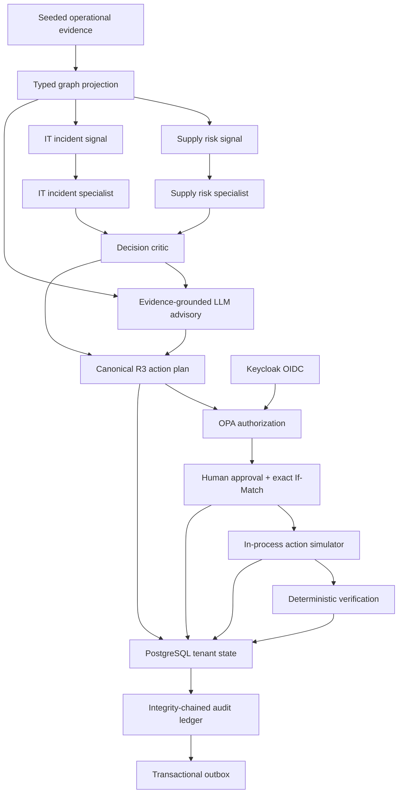

# NEXUS

[](https://github.com/Anitej05/Nexus/actions/workflows/ci.yml)
[](https://www.python.org/)
[](LICENSE)
[](https://github.com/Anitej05/Nexus)

**NEXUS is a governed operational-intelligence platform prototype that turns connected business
evidence into explainable risk signals, coordinated agent analysis, and human-approved action.**

It combines a typed operational graph, deterministic ML-style risk baselines, concurrent
specialist agents, an evidence-grounded LLM advisory, policy enforcement, simulation, and an
append-only audit trail. The design is domain-oriented rather than tied to one industry: the same
control plane can eventually support supply chain, insurance, finance, IT operations, fraud, and
enterprise risk workflows.

> [!IMPORTANT]
> This repository contains a working, bounded prototype and a broader local platform foundation.
> It is not a hosted service or a production deployment. The demonstrated action is simulated,
> the graph is seeded, and the current risk signals are deterministic rather than live forecasts.

## Why NEXUS

Most operational systems stop at dashboards or isolated AI assistants. NEXUS explores a more
useful loop:

1. **Connect** operational facts as typed entities and relationships.
2. **Detect** cross-domain conditions with inspectable, versioned signals.
3. **Investigate** them with parallel specialist agents and a decision critic.
4. **Explain** the evidence through a bounded, cited GenAI advisory.
5. **Govern** the proposed action through identity, policy, approval, and separation of duties.
6. **Simulate and verify** the result before recording it in an integrity-chained audit ledger.

The central principle is that AI may accelerate analysis, but it cannot silently rewrite evidence,
policy, approval state, or execution state.

## Working showcase: Storm and Checkout Shift

The current end-to-end scenario, `storm-and-checkout-shift-v1`, deliberately crosses two business
domains:

| Domain | Evidence | Signal | Agent interpretation |
|---|---|---|---|
| Supply chain | Chennai port closure, three affected shipments, purchase orders, and component risk | `demo.supply-delay.v1`: **0.91** against a **0.80** threshold | Shipment delay risk requires operational review |
| IT operations | Checkout deployment, checkout/payments services, and ledger database timing | `demo.incident-risk.v1`: **0.94** against a **0.80** threshold | Incident risk is elevated, but temporal association is not treated as proof of root cause |
| Cross-domain | Shared shift context and allowlisted graph evidence | Decision critic | Correlated operational priority, with uncertainty preserved |

The governed path then:

- creates a content-addressed R3 plan for shipment `SHP-0042`;
- requires the exact plan hash, OPA authorization, and human approval;
- executes only an in-process reroute simulation;
- verifies the representative `delay_reduced` outcome with an observed 14-hour value; and
- reconstructs the final state from **11 ordered audit events** with matching outbox evidence.

The managed acceptance runner also proves tenant isolation, idempotent retries, same-key and
distinct-key concurrency, available and unavailable LLM paths, and sanitized artifact generation.

## What is implemented

| Capability | Current implementation |
|---|---|
| Operational graph | Immutable, typed, read-only projection with supply-chain and IT nodes, edges, sensitivities, and a seed digest |
| Risk analysis | Two inspectable, versioned deterministic baselines with features, thresholds, targets, and evidence-node references |
| Multi-agent orchestration | Supply and IT specialists fan out concurrently with `asyncio`, followed by a cross-domain decision critic |
| GenAI advisory | OpenAI-compatible structured-output adapter with canonical evidence, citation validation, bounded retries/timeouts, and deterministic degradation |
| Governed planning | Canonical SHA-256 plan identity, R3 risk classification, optimistic preconditions, and idempotent command semantics |
| Identity and authorization | Keycloak OIDC, tenant membership resolution, OPA policy decisions, scoped tokens, and fail-closed dependency behavior |
| Tenant isolation | PostgreSQL forced row-level security, caller-owned transactions, and separate runtime/migration/recovery roles |
| Action control | Human approval and separation-of-duties policy before an in-process simulated reroute |
| Audit and delivery | Internally tamper-evident per-tenant hash chain plus a transactional outbox and consumer receipts |
| User experience | Authenticated FastAPI dashboard, typed graph and trace views, bounded audit inspection, and read-only preview mode |
| Verification | Unit, contract, security, integration, managed Compose E2E, image, vulnerability, and secret-history gates |

## System architecture



PostgreSQL is authoritative for governed prototype state. The public run view is not mutated as an
unstructured blob; it is reduced from validated, ordered audit events. Invalid sequences,
cross-tenant evidence, mismatched policy operations, malformed model output, or stale plan hashes
fail closed.

## Multi-agent orchestration

NEXUS uses a bounded supervisor-style workflow rather than several independent chatbots:

- **Supply risk specialist** evaluates the port/shipment evidence and returns a typed finding with
  explicit uncertainty.
- **IT incident specialist** evaluates deployment/service evidence in parallel and avoids claiming
  causation from timing alone.
- **Decision critic** receives both specialist findings, identifies the cross-domain priority, and
  keeps the distinction between correlation and proven root cause.
- **Advisory LLM** receives a canonical, size-bounded evidence document and can return only the
  `SpecialistFinding` structured contract.
- **Deterministic reducer** remains authoritative. It validates evidence IDs, event ordering,
  policy evidence, model/prompt provenance, approval, execution, and verification before exposing
  state.

The two specialists run concurrently. The critic runs only after both complete, which makes the
coordination order explicit and testable. Every cited node must exist in the frozen graph
allowlist; an agent cannot introduce an untrusted entity into the decision path.

## ML and GenAI decision layer

### Versioned risk signals

The current signals are intentionally inspectable prototype baselines, not opaque predictive
claims. Each one includes:

- an exact model/rule version;
- a bounded score and threshold;
- the target entity;
- a finite feature map; and
- the graph nodes that support the result.

Input order and duplicate delivery are tested for deterministic behavior. Cross-tenant evidence,
missing/extra graph elements, unsafe numbers, and changed scenario digests are rejected.

### Evidence-grounded structured generation

The reusable `packages/llm` adapter provides:

- exact OpenAI-compatible model discovery;
- fixed developer instructions that treat supplied facts as untrusted data;
- canonical evidence serialization and content-bound idempotency;
- JSON Schema structured output for `SpecialistFinding`;
- one bounded repair attempt for invalid structured output;
- citation, tenant, version, depth, body-size, and output-size validation;
- total request deadlines and cancellation preservation; and
- typed `unavailable`, `timeout`, `malformed`, `invalid_output`, and `uncited` degradation states.

The LLM is **advisory only**. It cannot change a score, choose a different action, lower the risk
class, approve a plan, or mark execution as successful. If the provider fails, NEXUS produces a
deterministic fact-only briefing and keeps the workflow awaiting approval.

This prototype uses graph-grounded evidence synthesis rather than claiming a full vector-search
RAG pipeline. Embedding retrieval and live ontology search are natural future adapters.

## Governance and security model

- **Authentication:** RSA OIDC access tokens from Keycloak with strict issuer, audience, subject,
  signature, time, and workload classification.
- **Authorization:** OPA evaluates typed subject, tenant, resource, operation, risk, delegation,
  approval, and sensitivity facts. Provider or policy failure denies the operation.
- **Tenant isolation:** PostgreSQL forced RLS is applied inside a transaction-bound tenant session;
  external principal and membership mappings do not grant authority across tenants.
- **Action safety:** R3 execution requires a matching plan hash, a consumed approval, separation of
  duties, current policy evidence, and a strong quoted `If-Match` precondition.
- **Idempotency:** command identity is bound to canonical request semantics, so a reused key with a
  different body is rejected rather than replayed.
- **Auditability:** public payload schemas are allowlisted and recursively redacted before append;
  each tenant event links to the previous hash and is emitted to the outbox in the same transaction.
- **Operational safety:** published Compose ports bind to `127.0.0.1`, images run as a non-root
  user, secrets are excluded from artifacts, and public CI scans dependencies, images, and history.

The audit ledger is internally tamper-evident, not externally anchored or legally immutable.
External WORM storage, signing, and independent checkpoint custody remain outside this prototype.

## API surface

| Method | Route | Purpose |
|---|---|---|
| `POST` | `/api/v1/prototype/runs` | Create the governed scenario run |
| `GET` | `/api/v1/prototype/runs/{run_id}` | Read the tenant-scoped run state |
| `GET` | `/api/v1/prototype/runs/{run_id}/graph` | Inspect the typed evidence graph |
| `GET` | `/api/v1/prototype/runs/{run_id}/trace` | Inspect the ordered safe trace |
| `POST` | `/api/v1/prototype/runs/{run_id}/approval` | Approve or reject the exact current plan |
| `POST` | `/api/v1/prototype/runs/{run_id}/execute` | Execute the approved simulation |
| `GET` | `/api/v1/audit/events` | Query a bounded tenant audit snapshot |
| `GET` | `/prototype` | Open the authenticated operations dashboard |

Mutating routes require a bearer token, an `Idempotency-Key`, and, for approval/execution, the
strong quoted current plan hash in `If-Match`.

## Technology stack

| Layer | Technologies |
|---|---|
| API and contracts | Python 3.11, FastAPI, Pydantic v2, SQLAlchemy, asyncpg |
| Agents and GenAI | `asyncio`, typed specialist contracts, OpenAI-compatible structured output, DeepSeek proxy support |
| Data and governance | PostgreSQL, forced RLS, Keycloak, OPA, transactional outbox |
| Broader platform stack | Neo4j, Redpanda, Temporal, Redis, MinIO, MLflow |
| Observability | OpenTelemetry Collector, Prometheus, Grafana |
| Delivery and quality | Docker Compose, `uv`, Ruff, strict mypy, pytest, Playwright, Gitleaks, Trivy |

Neo4j, Redpanda, Temporal, Redis, MinIO, MLflow, and the observability services are provisioned in
the broader local-development stack. The bounded acceptance scenario does not claim to exercise
every one of them end to end.

## Quick read-only preview

Use this path to inspect the representative dashboard without authentication or mutation:

```powershell
git clone https://github.com/Anitej05/Nexus.git
Set-Location Nexus
uv sync --all-packages --frozen
uv run python -m http.server 8080 --bind 127.0.0.1 --directory apps/api/src/nexus_api/static/prototype
```

Open <http://127.0.0.1:8080/>. Preview mode is labeled as seeded demo data and keeps all governed
controls disabled.

## Governed managed acceptance run

### Prerequisites

- Git
- Python 3.11.9 and [`uv`](https://docs.astral.sh/uv/)
- Node.js 22.17.0 and npm 10
- Docker Engine or Docker Desktop with Docker Compose 2.24.4 or later
- An OpenAI-compatible endpoint at `http://127.0.0.1:9997/v1` exposing the exact model
  `deepseek-ai/DeepSeek-V4-Flash-0731`

The managed runner uses random loopback ports, creates only marked test resources, provisions
temporary principals, and removes its own containers/network afterward without deleting named
volumes or unrelated projects.

```powershell
uv sync --all-packages --frozen
npm ci --ignore-scripts
npx --no-install playwright install chromium
Copy-Item .env.example .env

$env:NEXUS_RUN_COMPOSE_TESTS = "1"
$env:NEXUS_PROTOTYPE_E2E_MANAGED = "1"
$env:NEXUS_KEYCLOAK_ADMIN = "admin"
$env:NEXUS_POSTGRES_PASSWORD = [guid]::NewGuid().ToString("N")
$env:NEXUS_RUNTIME_DATABASE_PASSWORD = [guid]::NewGuid().ToString("N")
$env:NEXUS_MIGRATION_DATABASE_PASSWORD = [guid]::NewGuid().ToString("N")
$env:NEXUS_AUDIT_RECOVERY_DATABASE_PASSWORD = [guid]::NewGuid().ToString("N")
$env:NEXUS_KEYCLOAK_ADMIN_PASSWORD = [guid]::NewGuid().ToString("N")
$env:NEXUS_KEYCLOAK_TEST_ADMIN_PASSWORD = [guid]::NewGuid().ToString("N")
$env:NEXUS_KEYCLOAK_TEST_VIEWER_PASSWORD = [guid]::NewGuid().ToString("N")
$env:NEXUS_OIDC_WORKER_CLIENT_SECRET = [guid]::NewGuid().ToString("N")

Invoke-RestMethod http://127.0.0.1:9997/v1/models | ConvertTo-Json -Depth 5
uv run python scripts/prototype/run_e2e_managed.py --dry-run
uv run python scripts/prototype/run_e2e_managed.py
```

Successful acceptance writes sanitized, git-ignored evidence:

```text
artifacts/prototype/storm-and-checkout-shift-v1.json
artifacts/prototype/storm-and-checkout-shift-v1.png
```

The JSON records signal values, provider/degradation status, concurrency checks, verification, and
the ordered event types. The PNG is an authenticated, populated dashboard snapshot with no bearer
token or credential material.

## Verification

The public CI gate is deterministic and does not require the external LLM proxy or opt-in live
Compose environment:

```powershell
uv lock --check
uv sync --all-packages --frozen
npm ci --ignore-scripts
uv run python scripts/generate_contracts.py --check
uv run ruff check .
uv run mypy apps packages
uv run pytest packages/contracts/tests packages/prototype/tests tests/unit tests/contract tests/security -q
node --test apps/api/src/nexus_api/static/prototype/prototype.behavior.test.cjs
uv run pip-audit
```

The curated release was additionally verified with:

- **717 passed** local tests and **50 explicitly guarded skips**;
- **711 passed** tests in the required GitHub CI selection;
- a real Keycloak -> membership -> OPA -> RLS -> agent/ML/LLM -> approval -> simulation ->
  verification -> audit/outbox acceptance run;
- API and worker image builds with no fixed HIGH/CRITICAL Trivy findings; and
- a Gitleaks scan of the complete reachable public history.

Live LLM, PostgreSQL, OPA, Keycloak, and managed acceptance checks remain explicitly opt-in.

## Repository map

```text
apps/api/               FastAPI application, governed prototype, routes, dashboard
apps/worker/            Worker process boundary
packages/contracts/     Immutable platform, evidence, and specialist contracts
packages/llm/           Bounded OpenAI-compatible structured-output adapter
packages/prototype/     Deterministic scoring and content-addressed evidence
packages/security/      OIDC, OPA client, tenancy, RLS, audit, and outbox controls
packages/storage/       Shared persistence and recursive redaction utilities
infrastructure/         Compose, Keycloak, OPA, streaming, ML, and observability config
scripts/prototype/      Guarded runner, managed environment, and LLM control proxy
tests/                  Unit, contract, security, integration, and opt-in live tests
```

## Prototype boundaries and direction

| Implemented now | Deliberately future work |
|---|---|
| One frozen cross-domain scenario | Configurable ontology/schema authoring and arbitrary workflows |
| Seeded read-only graph projection | Live ingestion and authoritative Neo4j projection pipelines |
| Deterministic versioned risk baselines | Trained forecasting, anomaly, causal, and online-learning services |
| Process-local concurrent specialists | Durable Temporal-backed agent execution and recovery |
| Evidence-grounded structured advisory | Embedding/vector retrieval and production RAG evaluation |
| Human-approved simulated reroute | Sandboxed real connectors with environment-specific action policies |
| Internal tamper evidence | External signing, WORM checkpoints, retention, and disaster-recovery custody |
| Local-development Compose | Hardened cloud deployment, scaling, SLOs, and operational runbooks |

The foundation is intentionally reusable: typed resources, tenant boundaries, policy evidence,
idempotent commands, agent findings, plans, approvals, verification, and audit events are not tied
to the demonstration's industry. New domains should arrive as reviewed adapters and contracts,
not as unchecked prompts.

## Security and contributing

Review [SECURITY.md](SECURITY.md) before running the stack or reporting a vulnerability. See
[CONTRIBUTING.md](CONTRIBUTING.md) for development expectations and required checks.

NEXUS is licensed under the [Apache License 2.0](LICENSE).
